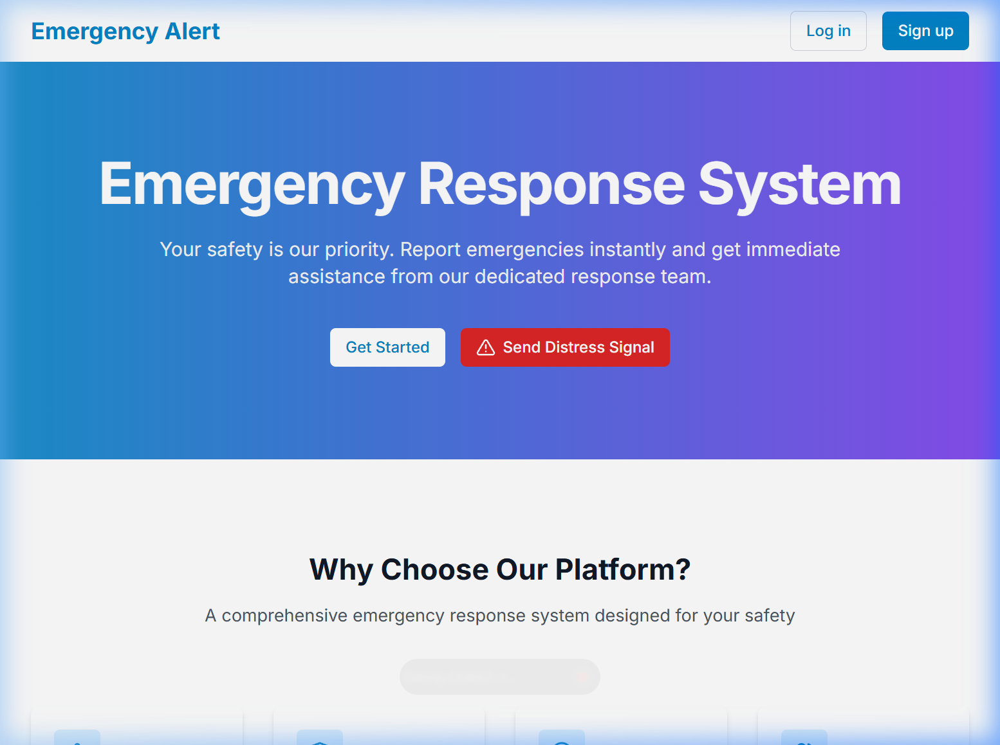
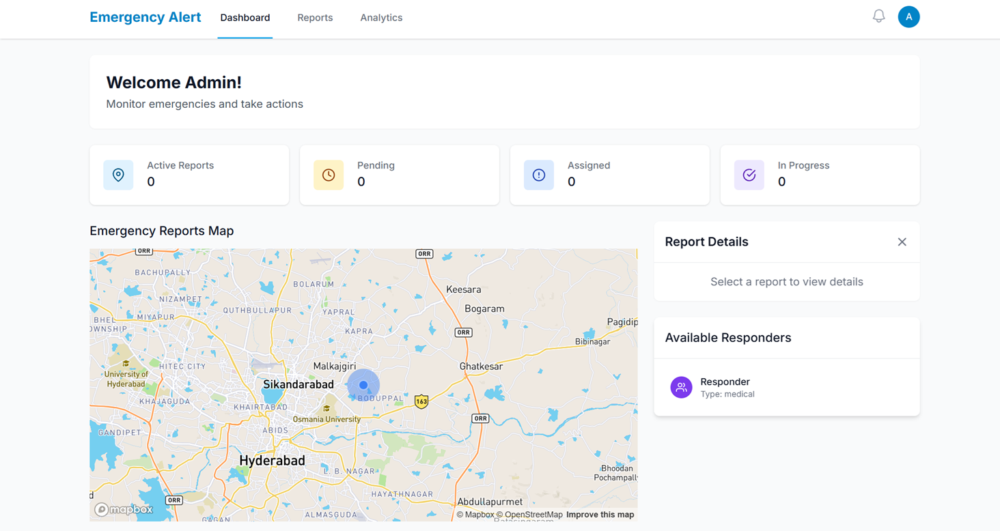
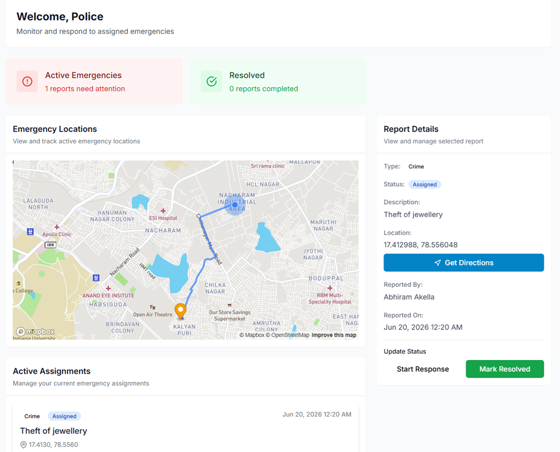

# Emergency Alert and Response System

A real-time web application designed to bridge the gap between citizens in distress, the general public, and emergency response services. The system enables users to report emergencies with precise location data, auto-dispatches the nearest responders, alerts nearby citizens to offer immediate assistance or evacuation, and provides interactive map tracking along with an AI-driven guidance chatbot.

## Core Features

### 1. Emergency Reporting and Media Uploads
* Detailed Incident Reporting: Users can log specific emergency types (Fire, Medical, Crime, and Other) along with descriptions.
* Multimedia Documentation: Support for uploading up to 5 files (images, audio, or video evidence) to help responders assess the situation beforehand.
* Automatic Location Retrieval: Captures GPS coordinates automatically to ensure responders can navigate precisely.

### 2. Distress System
* Quick SOS/Distress Button: A single-click reporting system that allows unregistered or anonymous users to submit immediate distress signals during critical events.

### 3. Automated Dispatch and Tracking
* Geospatial Distance Matching: Leverages geospatial matching to locate and assign the nearest active responder based on their real-time location.
* Incident Lifecycle Management: Responders can accept or reject assignments and update the incident status (Pending, Assigned, In Progress, Resolved) in real-time.
* Interactive Live Map: Integrated Mapbox layout showing active emergency locations, user coordinates, and responder routes.

### 4. Notifications and Alerts
* Broadcast Alerts: Automatically sends bulk notifications to all users located within a configurable radius of the emergency.
* Multi-Channel Communication: Uses Twilio API for SMS alerts and Nodemailer for email-based updates on critical status changes.
* Real-Time Socket Updates: Powered by Socket.io to stream real-time updates directly to dashboard sessions.

### 5. AI Guidance Chatbot
* First-Aid and Protocol Advice: An interactive chatbot integrated with the Google Gemini API to offer step-by-step safety guidance, first-aid procedures, and recommended actions based on the reported emergency type.

### 6. User and Administration Dashboards
* Role-Based Access Control: Specialized dashboards for regular users, responders, and administrative officers.
* Incident Analytics: Admin dashboard displays charts, active responders, and key emergency trends over time.

---

## Technical Architecture

### Frontend
* React.js (Vite development server)
* Tailwind CSS for styling
* Mapbox GL JS for interactive mapping
* Socket.io-client for real-time WebSocket connectivity
* Chart.js for visualization

### Backend
* Node.js and Express.js framework
* MongoDB with Mongoose ODM for data storage and geospatial queries
* Socket.io for managing duplex communication channels
* Multer for handling file uploads

### Third-Party Integrations
* Google Gemini API: Natural language processing for emergency instructions
* AWS S3: Secure and scalable media hosting for upload attachments
* Twilio: SMS messaging for instant notifications
* Nodemailer: SMTP email notification service
* Mapbox Directions API: Navigation routes for dispatched teams

---

## Getting Started

### Prerequisites
* Node.js (v18 or higher recommended)
* npm (v9 or higher)
* MongoDB database (local instance or MongoDB Atlas cluster)

### Environment Configuration

#### Backend Setup
Create a `.env` file inside the `backend` directory and configure the following variables:
```env
PORT=3000
MONGO_URI=your_mongodb_connection_string
JWT_SECRET=your_jwt_signing_secret
ADMIN_PASSKEY=admin_registration_passkey

# Nodemailer configuration
EMAIL_USER=your_email@gmail.com
EMAIL_PASS=your_email_app_password

# Twilio configuration
TWILIO_SID=your_twilio_sid
TWILIO_AUTH_TOKEN=your_twilio_auth_token
TWILIO_PHONE_NUMBER=your_twilio_assigned_number

# Gemini AI configuration
GEMINI_API_KEY=your_gemini_api_key

# AWS S3 configuration
AWS_ACCESS_KEY=your_aws_access_key
AWS_SECRET=your_aws_secret_key
S3_REGION=your_s3_bucket_region
S3_BUCKET_NAME=your_s3_bucket_name
```

#### Frontend Setup
Create a `.env` file in the root directory of the project and define:
```env
VITE_API_URL=http://localhost:3000
VITE_MAPBOX_TOKEN=your_mapbox_public_access_token
```

---

## Installation and Execution

### 1. Clone and Install Dependencies
Install dependencies for both the frontend (root directory) and backend service:

```bash
# Install frontend dependencies
npm install

# Install backend dependencies
cd backend
npm install
```

### 2. Run the Application
Start both servers in development mode:

```bash
# Start backend server (from backend directory)
npm start

# Start frontend application (from root directory)
npm run dev
```

The frontend will run at `http://localhost:5173` and the backend at `http://localhost:3000`.

---

## Application Screenshots

### Landing Page


### User Dashboard


### Admin Dashboard


### Responder Map Navigation

